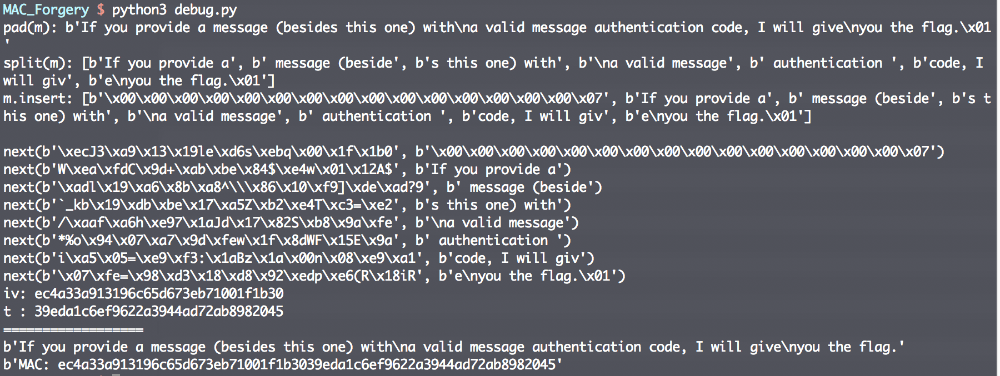
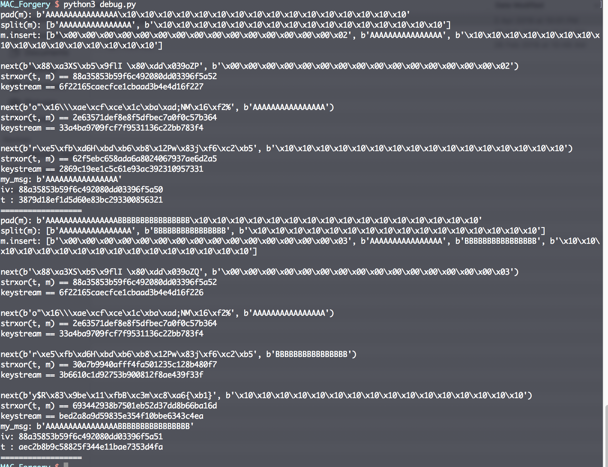
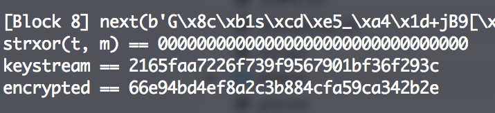
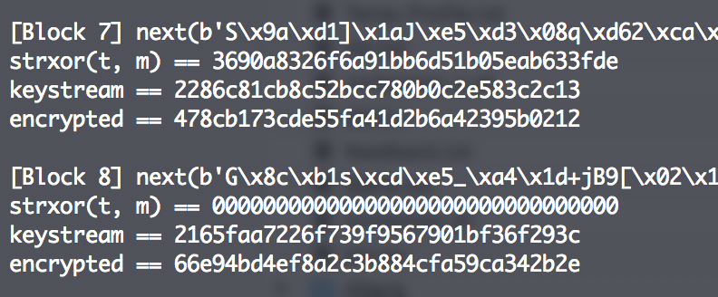
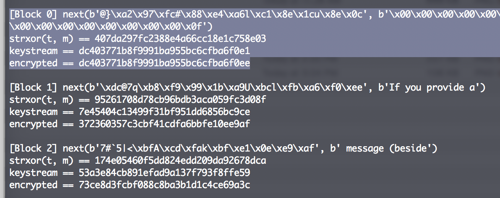
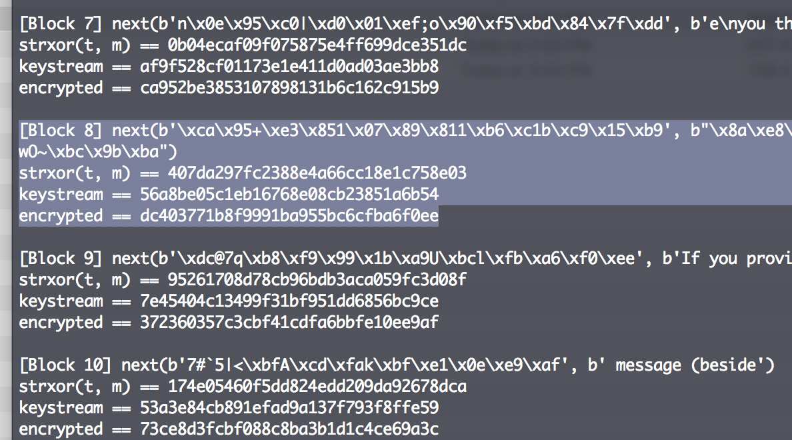
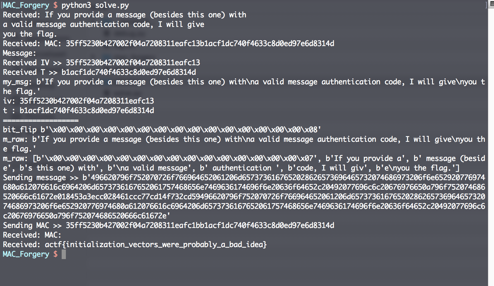

# MAC Forgery
Crypto

## Challenge 

CBC-MAC is so overrated. This new scheme supports variable lengths and multiple tags per message.

nc crypto.2019.chall.actf.co 19002

Author: defund

## Solution

A tough challenge on CBC-MAC.

#### The implementation

Let's first understand the code...

From cbc_mac.py

	def next(self, t, m):
		return AES.new(self.key, AES.MODE_ECB).encrypt(strxor(t, m))

We can see that it uses AES ECB, but they made it XOR the previous ciphertext block.

This means that it is simply an AES CBC (which they implemented themselves on top of AES ECB library)

Looking at the big picture, it is a variant of ***CBC-MAC which allows for variable block lengths***.

- https://en.wikipedia.org/wiki/CBC-MAC

In CBC-MAC, ***only the final block is used*** as the resultant signature.

#### AES CBC weakness

AES CBC has the main weakness of the Bit Flipping Attack.

- https://resources.infosecinstitute.com/cbc-byte-flipping-attack-101-approach/#gref

#### CBC-MAC weakness #1

In particular, variable length CBC-MAC can be forged by appending/concatting messages (length extension).

- https://blog.cryptographyengineering.com/2013/02/15/why-i-hate-cbc-mac/
- https://scienceblogs.com/goodmath/2008/10/24/how-not-to-do-message-integrit
- https://crypto.stackexchange.com/questions/11538/forge-cbc-mac-given-the-mac-of-two-messages-and-of-their-concatenation
- https://security.stackexchange.com/questions/123793/why-is-cbc-mac-insecure-for-variable-length-input

> Most notably, if your system allows for variable-length messages — as it should — there is a simple attack that allows you to forge new messages. First, get a MAC T on a message M1. Now XOR the tag T into the first block of some arbitrary second message M2, and get a MAC on the modified version of M2.

> The standard fix to prepend the message length to the first block of the message before MACing it. But a surprisingly large number of (dumb) implementations skip this extra step. And many CBC-MAC implementations are dumb implementations.

---

From the code, there is a prepended length.

	def mac(self, m, iv):
		m = pad(m, self.BLOCK_SIZE)
		m = split(m, self.BLOCK_SIZE)
		m.insert(0, long_to_bytes(len(m), self.BLOCK_SIZE))
		# The length of the blocks is prepended here...
		t = iv
		for i in range(len(m)):
			t = self.next(t, m[i])
		return t

Prepended length will improve the security, although there is still a way around it.

- https://ipfs-sec.stackexchange.cloudflare-ipfs.com/crypto/A/question/34445.html
- https://en.wikipedia.org/wiki/CBC-MAC#Security_with_fixed_and_variable-length_messages

However, that said, we know that our attack plan will be ***appending messages***.

#### CBC-MAC weakness #2

Randomised IV is used.

- https://crypto.stackexchange.com/questions/1075/why-is-it-insecure-to-use-a-randomized-iv-for-cbc-mac-instead-of-an-all-zero-iv

Let's look at the code again

Code for welcome message

	iv, t = cbc_mac.generate(welcome)
	self.write(welcome)
	self.write(b'MAC: %b' % binascii.hexlify(iv+t))
	
Code to verify user input

	m = binascii.unhexlify(self.query(b'Message: '))
	mac = binascii.unhexlify(self.query(b'MAC: '))
	assert len(mac) == 32
	iv = mac[:16]
	t = mac[16:]

	if m != welcome and cbc_mac.verify(m, iv, t):
		self.write(flag)

Notice that we can input our own IV. This is the major weakness to exploit. An AES CBC bit flipping can be used.

#### Forming the attack.

Doing a debugging of the code, we see that a block size is prepended in Block 0 and the padding is also appended to the end.

This screenshot shows all the intermediate steps. It is impossible to derive the key. However, we can modify the IV to control our blocks

---

After lots of trial and error, I realised that we have the `CBC-MAC` of the original message

	Let CBC-MAC(welcome) = t

So if we were to append one block afterwards, we get this

	CBC-MAC(welcome || append) = t'
	
	where t' = AES-CBC(t XOR append)

If we were to control such that the append block is equal to t, we can get the following

	If t == append, then 
	t XOR append == 0

	t' = AES-CBC(0x00)

This is precisely what we see. By submitting the original signature, we can make it XOR until the whole block 8 is zeroed out.

Between runs (as long as the key is constant), the encryption is always the same.

---

Knowing this, can we take advantage of this? Instead of making the input all zeros, we can make the input point back to Block 0..

This is the content of block 0, 1, 2

The original welcome message is 7 blocks long. Just now, we were able to control it to zero out the contents of block 8.

So instead, let's control block 8 to point back to block 1 contents as follows.

And then for the next 7 blocks (block 8 through block 15), it will be exactly the same as (block 1 through block 6). *Block 0 is the prepended length, block 7 is the controlling block to point back to block 1.*

In equation, it is roughly like this

	Bit Flip Attack:
		Modify IV and also the prepended length
		Let's call the modification as IV', Length'

		If block length changes from 2 to 3, we must modify IV such that
		IV' = IV ^ (2 ^ 3)

		By modifying IV and Block 0 (prepended length) to match each other,
		Block 1 will remain untouched and the signature at block 7 is untouched.

		In equation, this holds true,
		(IV' XOR Length') == (IV XOR Length)

	Original:
		welcome = IV  || Length  || M1...Mn-1 || (Mn || Padding)

	Modified
		my_msg  = IV' || Length' || M1...Mn-1 || [Mx] || (Mn || Padding)

		// where Mx is block 7 to control to point back to block 1.

So hence our payload will be

	payload = welcome || control_block || welcome
	
	// where control_block = t^iv^block0

Doing so, we get the flag.

## Flag

	actf{initialization_vectors_were_probably_a_bad_idea}
