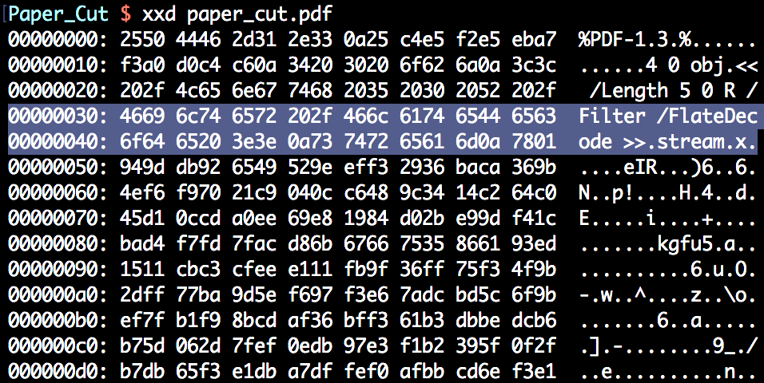
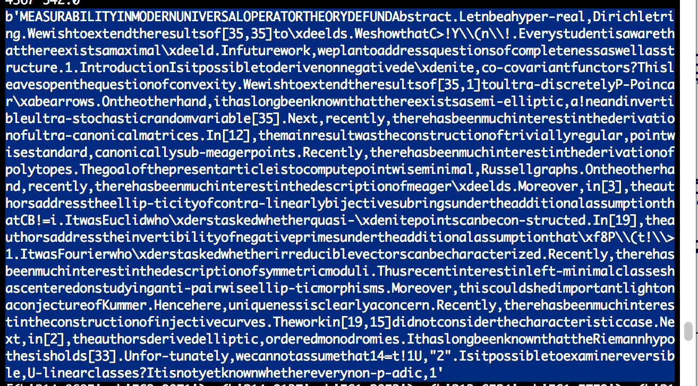
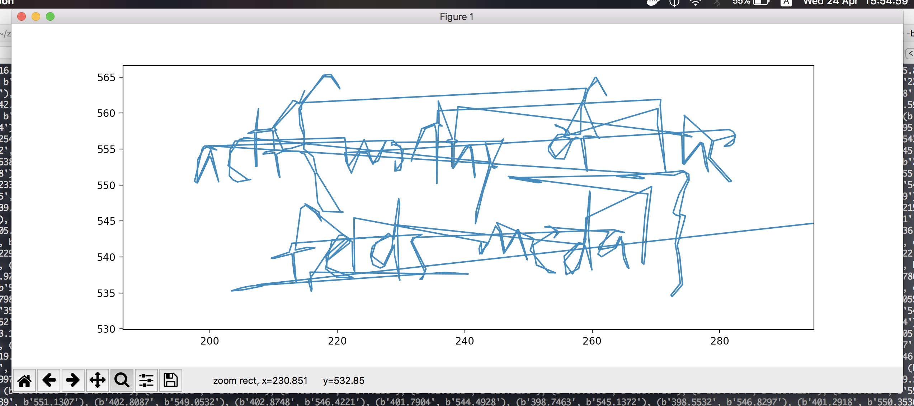
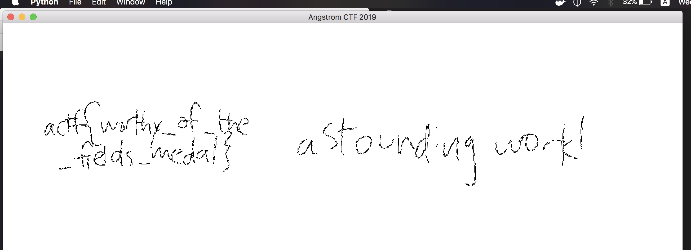

# Paper Cut
Misc

## Challenge 

defund submitted a math paper to a research conference and received a few comments from the editors. Unfortunately, we only have a fragment of the returned paper.

Author: defund

[paper_cut.pdf](paper_cut.pdf)

## Solution

We have a PDF with no trailer / xref table

	$ exiftool paper_cut.pdf 
	ExifTool Version Number         : 11.11
	File Name                       : paper_cut.pdf
	Directory                       : .
	File Size                       : 32 kB
	File Modification Date/Time     : 2019:04:21 22:23:44+08:00
	File Access Date/Time           : 2019:04:22 00:00:00+08:00
	File Inode Change Date/Time     : 2019:04:21 22:24:06+08:00
	File Permissions                : rw-r--r--
	File Type                       : PDF
	File Type Extension             : pdf
	MIME Type                       : application/pdf
	PDF Version                     : 1.3
	Linearized                      : No
	Warning                         : Invalid xref table

Usually some corrupted PDFs can be rendered by Ghostscript. But in this case it did not process the file.

	$ gs   -o repaired.pdf   -sDEVICE=pdfwrite   -dPDFSETTINGS=/prepress  paper_cut.pdf
	GPL Ghostscript 9.25 (2018-09-13)
	Copyright (C) 2018 Artifex Software, Inc.  All rights reserved.
	This software comes with NO WARRANTY: see the file PUBLIC for details.
	   **** Error: Cannot find a 'startxref' anywhere in the file.
	               Output may be incorrect.
	   **** Error:  An error occurred while reading an XREF table.
	   **** The file has been damaged.  This may have been caused
	   **** by a problem while converting or transfering the file.
	   **** Ghostscript will attempt to recover the data.
	   **** However, the output may be incorrect.
	   **** Error:  Trailer dictionary not found.
	                Output may be incorrect.
	   No pages will be processed (FirstPage > LastPage).

	   **** This file had errors that were repaired or ignored.
	   **** Please notify the author of the software that produced this
	   **** file that it does not conform to Adobe's published PDF
	   **** specification.

	   **** The rendered output from this file may be incorrect.
	

If we look in the PDF file, we realise that there is a `stream` but no `endstream`. 

This means that we can try to manually parse the stream of whatever content is left.

We also see it has a encoding of `FlateDecode`.

---

Reference for PDF file format (content stream):

- https://pspdfkit.com/blog/2018/pdf-text-extraction/
- http://what-when-how.com/itext-5/parsing-pdfs-part-1-itext-5/
- https://commandlinefanatic.com/cgi-bin/showarticle.cgi?article=art019
- https://labs.appligent.com/pdfblog/pdf-hello-world/
- https://resources.infosecinstitute.com/pdf-file-format-basic-structure/

Extracting FlateDecode content stream from PDF:

- http://binaryhax0r.blogspot.com/2010/06/flatedecode-decoder.html
- https://stackoverflow.com/questions/20620374/how-to-inflate-a-partial-zlib-file
- https://stackoverflow.com/questions/42791781/uncompress-and-save-zlib-data-in-pdf-with-python
- https://forums.adobe.com/thread/1663978
- https://gist.github.com/averagesecurityguy/ba8d9ed3c59c1deffbd1390dafa5a3c2

---

So putting it into a Python script, I extracted the content stream and also all the text.

This leaves me with the following text.

However, there is no flag to be seen.

This was when I realised that there are a whole bunch of coordinates after all the texts have been rendered.

--- 

Content Stream Operators

- https://www.adobe.com/content/dam/acom/en/devnet/pdf/pdfs/pdf_reference_archives/PDFReference.pdf (Page 700)
- https://github.com/galkahana/HummusJS/wiki/Use-the-pdf-drawing-operators

---

From the operators, it appears to be drawing operators at the defined coordinates.

With this, I extracted all coordinates and then simply plotted it on a graph

From this, we can somewhat see the flag. But then it is all in discrete points which is hard to make out.

Here I had to look properly at the operators in the content stream. 

	// Extracted from Adobe PDF reference document
	m moveto      Begin new subpath
	l lineto      Append straight line segment to path
	c curveto     Append curved segment to path (three control points)

I implemented the line and curves on a Canvas in the script and thus got the following

Final script

[solve.py](solve.py)

## Flag

	actf{worthy_of_the_fields_medal}
