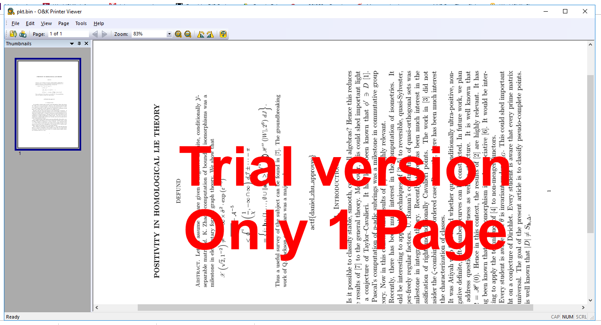

# Printer Paper
Misc

## Challenge 

We need to collect more of defund's math papers to gather evidence against him. See if you can find anything in the data packets we've intercepted from his printer.

Author: defund

## Hint

https://github.com/koenkooi/foo2zjs

## Solution

From the pcapng file open in Wireshark. We see these packets

Packet 2

	sMFG:Hewlett-Packard;MDL:HP LaserJet P1505n;CMD:HBS,PJL,ACL,PCL;CLS:PRINTER;DES:HP LaserJet P1505n;FWVER:20100617;

Packet 9

	%-12345X@PJL
	@PJL JOB NAME = "paper.pdf" DISPLAY = "15 wiwang paper.pdf"
	@PJL SET USERNAME = "wiwang"
	@PJL SET DENSITY=3 
	@PJL SET JAMRECOVERY=OFF 
	@PJL SET ECONOMODE=OFF 
	@PJL SET RET=MEDIUM 
	%-12345X

There is a printer file after that between packet 15 and packet 27. I extracted it and concatted them together.

---

Searching online it is a HP XQX job.

- https://www.tachytelic.net/2010/10/hp-direct-pdf-printing-and-printer-tray-control/

The hint also shows us to the driver page. https://github.com/koenkooi/foo2zjs

    FOO2XQX
    -------
    foo2xqx  converts  Ghostscript  pbmraw  to  monochrome XQX streams, for
    driving the HP LaserJet M1005 MFP and other XQX-based printers

Using XQX Decode, I got no useful information
http://manpages.ubuntu.com/manpages/xenial/man1/xqxdecode.1.html

	# wget https://github.com/mikerr/foo2zjs/blob/master/xqxdecode
	# ./xqxdecode -o -h < pkt.bin 
	0:	XQX_MAGIC, 0x5851582c (,XQX)
	4:	XQX_START_DOC(1), 7 items
	12:		XQXI_0x80000000, 84 (0x54)
	24:		XQXI_0x10000005, 1 (0x1)
	36:		XQXI_0x10000001, 0 (0x0)
	48:		XQXI_DMDUPLEX, 0 (0x0)
	60:		XQXI_0x10000000, 0 (0x0)
	72:		XQXI_0x10000003, 1 (0x1)
	84:		XQXI_END, -559038737 (0xdeadbeef)
	96:	XQX_START_PAGE(3), 15 items [Page 1]
	104:		XQXI_0x80000000, 180 (0xb4)
	116:		XQXI_0x20000005, 1 (0x1)
	128:		XQXI_DMDEFAULTSOURCE, 7 (0x7)
	140:		XQXI_DMMEDIATYPE, 1 (0x1)
	152:		XQXI_0x20000007, 1 (0x1)
	164:		XQXI_RESOLUTION_X, 600 (0x258)
	176:		XQXI_RESOLUTION_Y, 600 (0x258)
	188:		XQXI_RASTER_X, 4800 (0x12c0)
	200:		XQXI_RASTER_Y, 6360 (0x18d8)
	212:		XQXI_VIDEO_BPP, 1 (0x1)
	224:		XQXI_VIDEO_X, 4800 (0x12c0)
	236:		XQXI_VIDEO_Y, 6360 (0x18d8)
	248:		XQXI_ECONOMODE, 0 (0x0)
	260:		XQXI_DMPAPER, 1 (0x1)
	272:		XQXI_END, -559038737 (0xdeadbeef)
	284:	XQX_START_PLANE(5), 4 items
	292:		XQXI_0x80000000, 64 (0x40)
	304:		XQXI_0x40000000, 0 (0x0)
	316:		XQXI_BIH(0x40000002)
			DL = 0, D = 0, P = 1, - = 0, XY = 4800 x 6360
			L0 = 128, MX = 0, MY = 0
			Order   = 3  ILEAVE SMID
			Options = 92  LRLTWO TPDON TPBON DPON
			50 stripes, 0 layers, 1 planes

	344:		XQXI_END, -559038737 (0xdeadbeef)
	356:	XQX_JBIG(7), 51881 items
	52245:	XQX_END_PLANE(6), 0 items
	52253:	XQX_END_PAGE(4), 0 items
	52261:	XQX_END_DOC(2), 0 items
	Total size: 51881 bytes
	0:	\033%-12345X@PJL
	14:	@PJL RDYMSG DISPLAY = ""
	39:	@PJL EOJ
	48:	\033%-12345X

After which I decided to search around. I eventually found a software to render the print job (ZjStream protocol).

- https://www.prnwatch.com/ok-printer-viewer/

## Flag

	actf{daniel_zhu_approves}
