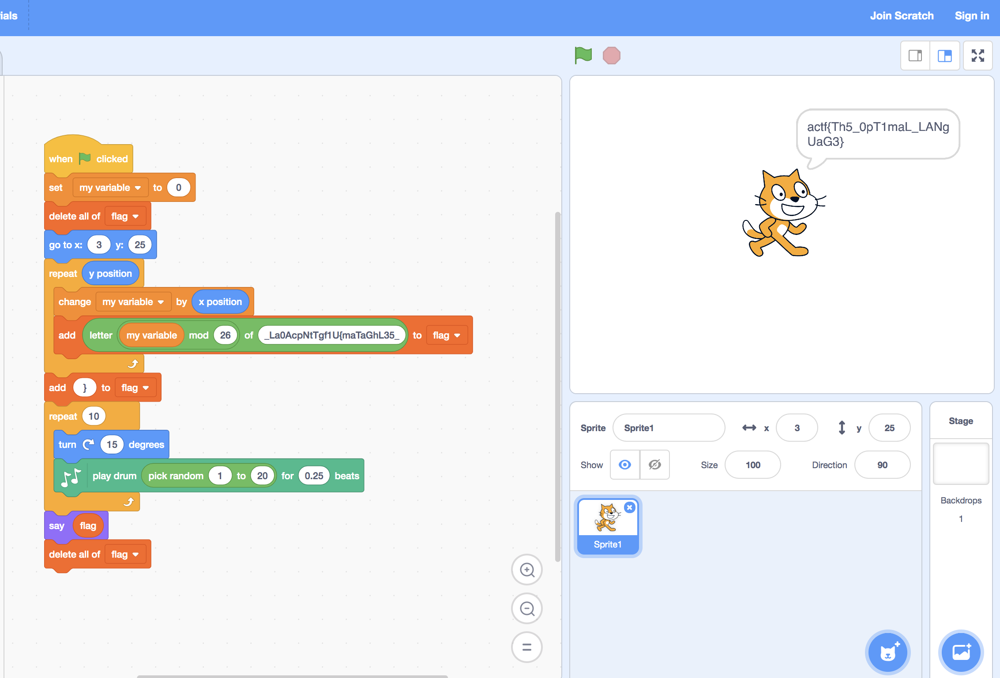

# Scratch It Out
Misc

## Challenge 
An oddly yellow cat handed me this message - what could it mean?

Author: innoviox

project.json

## Hint
Zipped with standard files.

## Solution

From the hint, ZIP up the json file and rename it to .sb2

- https://en.scratch-wiki.info/wiki/Scratch_File_Format

Load it into the online Scratch editor

- https://scratch.mit.edu/projects/editor/?tutorial=home

## Flag

	actf{Th5_0pT1maL_LANgUaG3}
