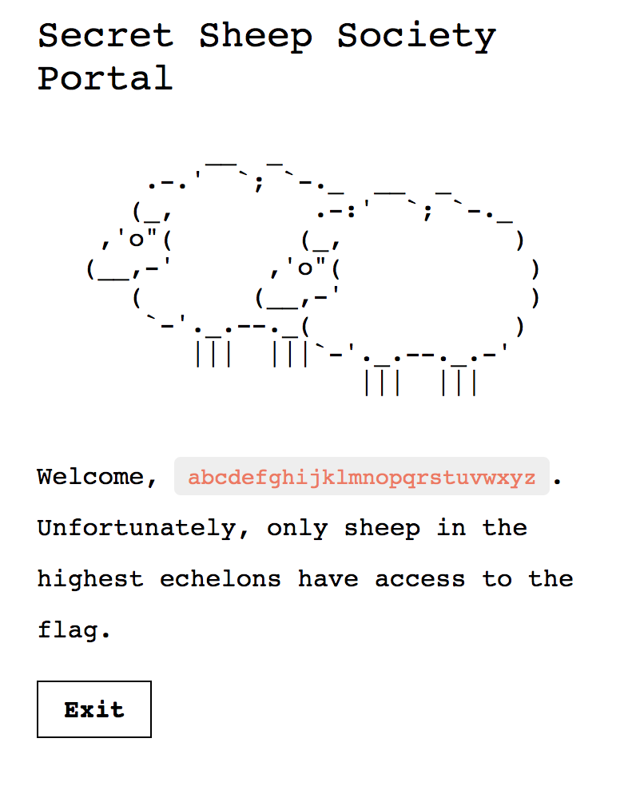
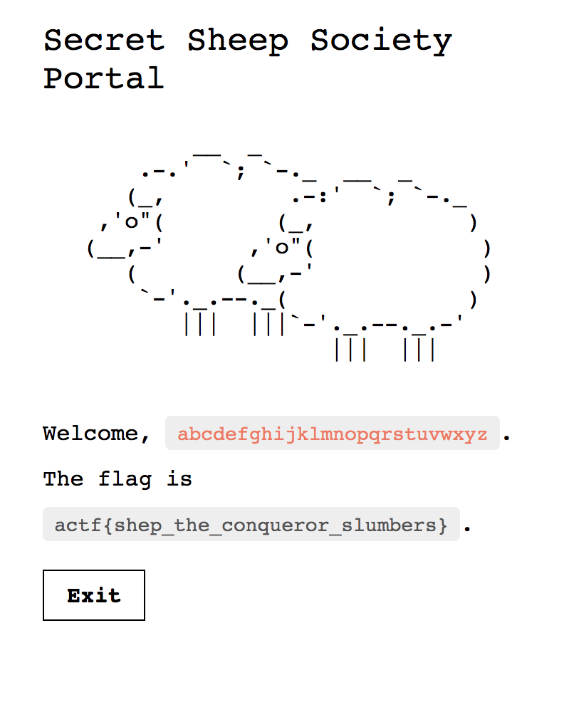

# Secret Sheep Society
Crypto

## Challenge 

The sheep are up to no good. They have a web portal for their secret society, which we have the source for. It seems fairly easy to join the organization, but climbing up its ranks is a different story.

Author: defund

https://secretsheepsociety.2019.chall.actf.co/

## Solution

From the code we have the text

	
	Welcome, {{ session['handle'] }}.  The flag is {{ flag }}.  Unfortunately, only sheep in the highest echelons have access to the flag. 

	
	Handle
	 
	

Trying to do a template injection, it failed because render_template() was used in the source code, meaning that it is not vulnerable.

But if we look at the Manager class, we realise it is using AES CBC. Since this is a Crypto challenge, it seems we need to attack it...

##### Session cookie

	session = {
		'admin': False,
		'handle': handle
	}
	token = manager.pack(session)

We get this from the browser cookies

	document.cookie
	"token=1hE2zRYdRTR6KDxtYAtGLDQJ5qIFyYRr45/eDlJAOGSoYJQb2+mFXxYzaS3Ge3Nz8l+Jaev3kR/Ih3yUMcR2zmJfYklgewHLSDVfUuz1JIo="

##### Manager class

	class Manager:

	BLOCK_SIZE = AES.block_size

	def __init__(self, key):
		self.key = key

	def pack(self, session):
		cipher = AES.new(self.key, AES.MODE_CBC)
		iv = cipher.iv
		dec = json.dumps(session).encode()
		enc = cipher.encrypt(pad(dec, self.BLOCK_SIZE))
		raw = iv + enc
		return base64.b64encode(raw)

	def unpack(self, token):
		raw = base64.b64decode(token)
		iv = raw[:self.BLOCK_SIZE]
		enc = raw[self.BLOCK_SIZE:]
		cipher = AES.new(self.key, AES.MODE_CBC, iv)
		dec = unpad(cipher.decrypt(enc), self.BLOCK_SIZE)
		return json.loads(dec.decode())

Knowing the flaw of AES CBC, we can do an XOR to get the bitstream and modify the plaintext to produce a working ciphertext

Thankfully, the admin parameter is in the first 16 bytes, hence we only need to modify the first block

	$ python3 solve.py 
	original pt: b'{"admin": false, "handle": "abcdefghijklmnopqrstuvwxyz"}'
	modified pt: b'{"admin": true , "handle": "abcdefghijklmnopqrstuvwxyz"}'
	[0] keystream: b'\xad3W\xa9{t+\x16@\x08Z\x0c\x0cx#\x00'
	[0] modified block: b'\xd6\x116\xcd\x16\x1dE4z(.~y\x1d\x03,'
	modified ct: b'\xd6\x116\xcd\x16\x1dE4z(.~y\x1d\x03,4\t\xe6\xa2\x05\xc9\x84k\xe3\x9f\xde\x0eR@8d\xa8`\x94\x1b\xdb\xe9\x85_\x163i-\xc6{ss\xf2_\x89i\xeb\xf7\x91\x1f\xc8\x87|\x941\xc4v\xceb_bI`{\x01\xcbH5_R\xec\xf5$\x8a'
	payload: 1hE2zRYdRTR6KC5+eR0DLDQJ5qIFyYRr45/eDlJAOGSoYJQb2+mFXxYzaS3Ge3Nz8l+Jaev3kR/Ih3yUMcR2zmJfYklgewHLSDVfUuz1JIo=

Input into the browser cookies

## Flag

	ctf{shep_the_conqueror_slumbers}
